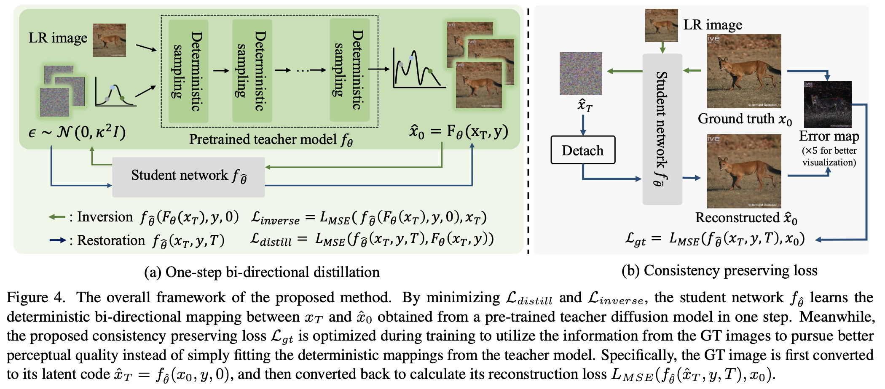
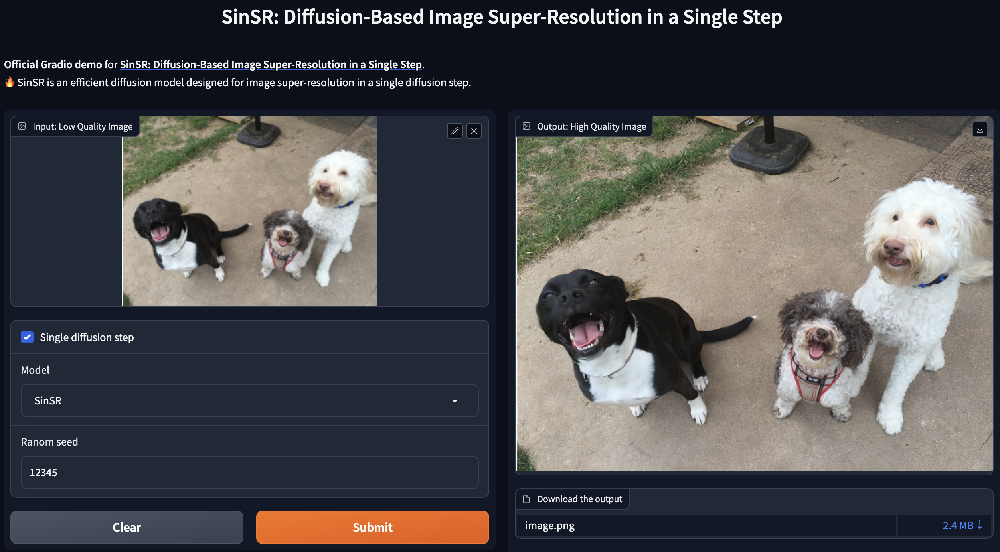

# [CVPR 24］SinSR: Diffusion-Based Image Super-Resolution in a Single Step
Welcome! This is the official implementation of the paper "[SinSR: Diffusion-Based Image Super-Resolution in a Single Step](https://arxiv.org/pdf/2311.14760.pdf)".

- Yufei Wang, Wenhan Yang, Xinyuan Chen, Yaohui Wang, Lanqing Guo, Lap-Pui Chau, Ziwei Liu, Yu Qiao, Alex C. Kot, Bihan Wen

- $^1$ Nanyang Technological University, $^2$ Peng Cheng Laboratory, $^3$ Shanghai Artificial Intelligence Laboratory, $^4$ The Hong Kong Polytechnic University
  

## :turtle: Requirements
* Python 3.10, Pytorch 2.1.2, [xformers](https://github.com/facebookresearch/xformers) 0.0.23
* More detail (See [environment.yml](environment.yml))
A suitable [conda](https://conda.io/) environment named `resshift` can be created and activated with:

```
conda env create -n SinSR python=3.10
conda activate SinSR
pip install -r requirements.txt
```
or
```
conda env create -f environment.yml
conda activate SinSR
```
## :whale: Demo
You can try our method through an online demo:
```sh
python app.py
```

(The time taken for the initial run of the model includes loading the model. Besides, it includes a significant amount of time overhead apart from the algorithms itself, e.g., I/O cost, and web frameworks.)

## :rocket: Fast Testing
```sh
python3 inference.py -i [image folder/image path] -o [result folder] --ckpt weights/SinSR_v1.pth --scale 4 --one_step
```

# Run it on Colab
You can run the code on Google Colab by clicking on the following link: [](https://colab.research.google.com/github/LuisFMCuriel/SinSR/blob/colab_demo/colab-demo.ipynb)

# Requirements
## :dolphin: Reproducing the results in the paper
### Results in Table 1
- Real data for image super-resolution: [RealSet65](testdata/RealSet65) | [RealSR](testdata/RealSR)
- Test the model
```sh
# Results on RealSet65
python inference.py -i testdata/RealSet65 -o results/SinSR/RealSet65 --scale 4 --ckpt weights/SinSR_v1.pth --one_step
    ## Re-evaulated on a RTX3090
    # clipiqa: 0.72046
    # musiq: 62.25337

# Results on RealSR
python inference.py -i testdata/RealSet65 -o results/SinSR/RealSR --scale 4 --ckpt weights/SinSR_v2.pth --one_step
    ## Re-evaulated on a RTX3090
    ### Similar to ResShift, this model is obtained by early stop
    # clipiqa: 0.69152
    # musiq: 61.43469
```
If you are running on a GPU with limited memory, you could reduce the patch size by setting ```--chop_size 256``` to avoid out of memory. However, this will slightly degrade the performance.
```sh
# Results on RealSet65
python inference.py -i testdata/RealSet65 -o results/SinSR/RealSet65 --scale 4 --ckpt weights/SinSR_v1.pth --one_step --chop_size 256 --task SinSR

# Results on RealSR
python inference.py -i testdata/RealSR -o results/SinSR/RealSR --scale 4 --ckpt weights/SinSR_v2.pth --one_step --chop_size 256 --task SinSR
```

### Results in Table 2
- Download the image ImageNet-Test [(Link)](https://drive.google.com/file/d/1NhmpON2dB2LjManfX6uIj8Pj_Jx6N-6l/view?usp=sharing) to the [testdata](testdata) folder.
- Unzip the downloaded dataset.
- Test the model
```sh
python inference.py -i testdata/imagenet256/lq/ -o results/SinSR/imagenet  -r testdata/imagenet256/gt/ --scale 4 --ckpt weights/SinSR_v1.pth --one_step
    ## Re-evaulated on a RTX3090
    # clipiqa: 0.60969
    # musiq: 53.51805
    # psnr: 24.70071
    # lpips: 0.21882
    # ssim: 0.66364
```

## :airplane: Training
### Preparing stage
1. Download the necessary pre-trained model, i.e., pretrained ResShift, and Autoencoder. This can be achieved by inferece using ResShift and the needed models will be downloaded automatically.
```sh
# Method 1
python3 app.py # Select the model to ResShift in the webpage
# Method 2
python inference.py --task realsrx4 -i [image folder/image path] -o [result folder] --scale 4 # Inference using ResShift
```
1. Adjust the data path in the config file. Specifically, correct and complete paths in files of [traindata](./traindata/)
2. Adjust batchsize according your GPUS.
    + configs.train.batch: [training batchsize, validation btatchsize]
    + configs.train.microbatch: total batchsize = microbatch * #GPUS * num_grad_accumulation
### Train the model
```sh
python3 main_distill.py --cfg_path configs/SinSR.yaml --save_dir logs/SinSR
```
We find that the model can converge very quickly, e.g., a few thousand iterations. Therefore, we believe that the proposed method could be applied to other diffuson-based SR models and encourage a try if you are interested.

## :heart: Acknowledgement

This project is based on [ResShift](https://github.com/zsyOAOA/ResShift). Thanks for the help from the author.

## :star: Citation
Please cite our paper if you find our work useful. Thanks! 
```
@inproceedings{wang2024sinsr,
  title={SinSR: diffusion-based image super-resolution in a single step},
  author={Wang, Yufei and Yang, Wenhan and Chen, Xinyuan and Wang, Yaohui and Guo, Lanqing and Chau, Lap-Pui and Liu, Ziwei and Qiao, Yu and Kot, Alex C and Wen, Bihan},
  booktitle={Proceedings of the IEEE/CVF Conference on Computer Vision and Pattern Recognition},
  pages={25796--25805},
  year={2024}
}
```

## :email: Contact
If you have any questions, please feel free to contact me via `yufei001@ntu.edu.sg`.